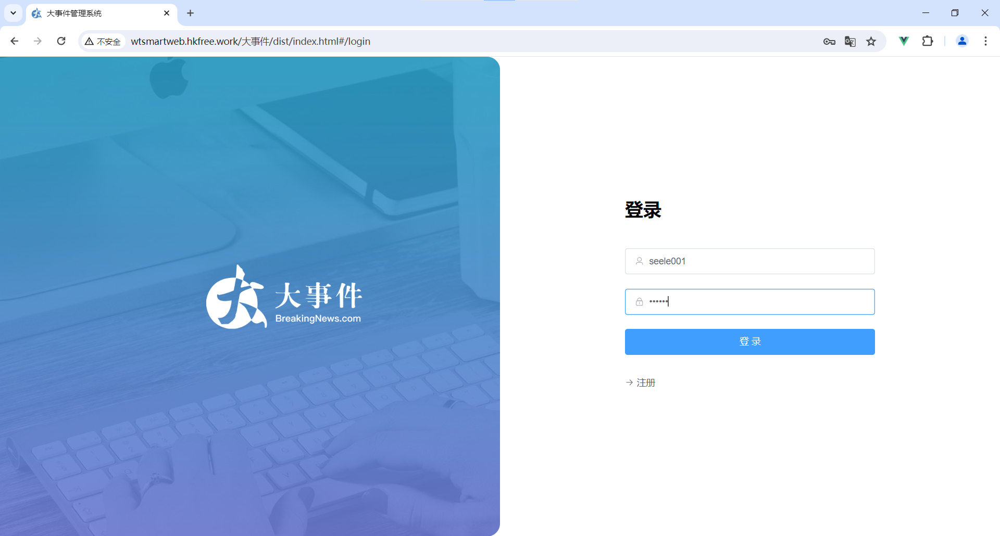
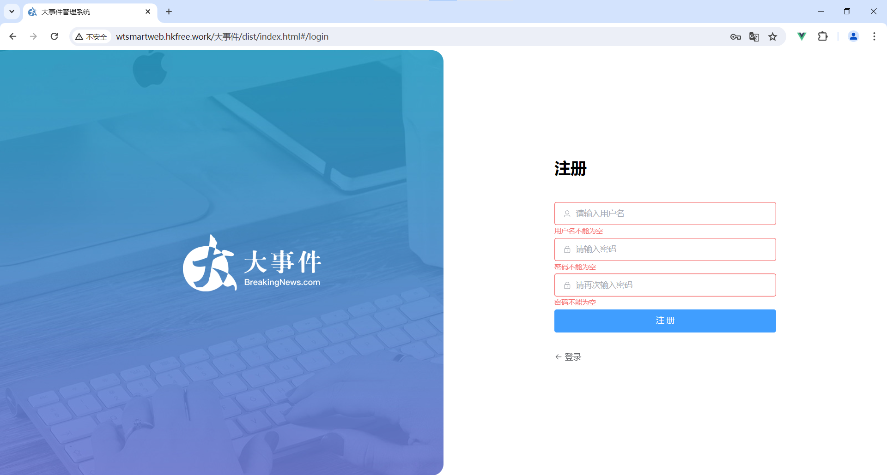
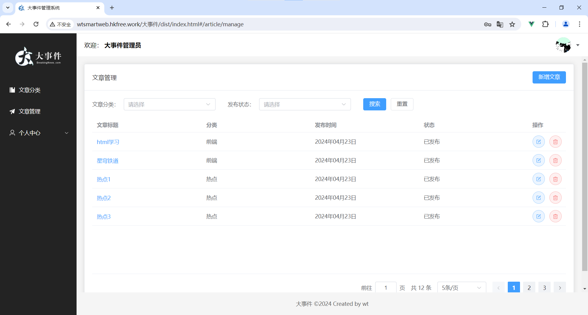
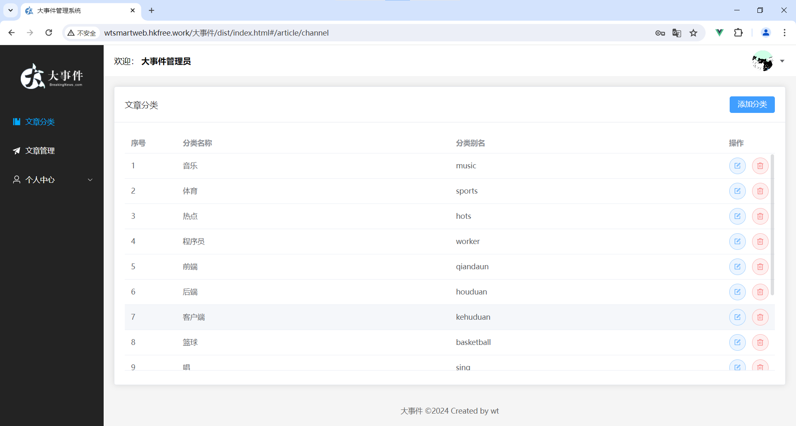
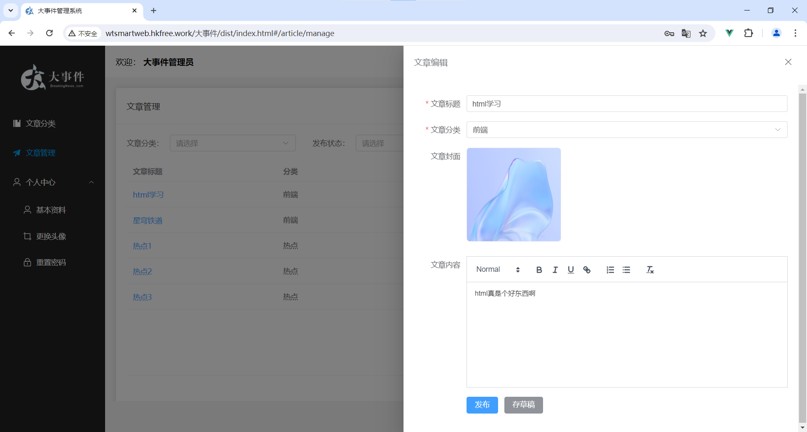
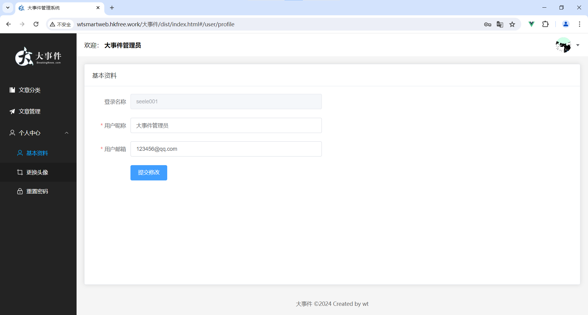

# 大事件管理系统
## 项目介绍
1. 基于vue3的大事件管理系统，具有登录功能，用户可以发布文章，并对发布的文章进行管理
2. 技术栈：html、css、scss、js、es6、vue3、vue-router、pinia、vite、axios、element-plus
## 项目难点
难点一：子组件文章下拉选框组件选中的值回显到父组件中，并且父组件中获得选中的文章分类id

解决办法：将父组件中的文章id通过v-model传给子组件，子组件中通过defineProps接收，由于子组件中的下拉框不能通过v-model与父组件传递过来的id值双向绑定，因此需要将v-model进行拆解，首先子组件中用:modelValue来接受父组件传递过来的id值，然后在下拉选框上用:modelValue来接收id值，来控制选框中的值。然后通过给下拉框绑定事件@update:modelValue，并用$event获取下拉框的值作为参数传递给父组件，这样父组件就获得了当前选中分类的id值，父组件再传给子组件，子组件接收到了选中的分类id值便会将对应的option选项展示出来。

------

难点二：新增文章的图片预览功能实现和编辑文章功能的图片回显

解决办法：对于新增文章的图片预览功能，我是用el-upload组件，首先，清楚action自动上传和on-success成功提示。然后其中img标签中的图片地址imgUrl绑定了js中的imgUrl数据，然后调用URL.createObjectURL方法，传入el-upload内部绑定的uploadFile.raw，将转换后的地址给imgUrl，即可实现图片预览。对于图片回显，先导入request基本请求中的baseURL，然后拼接从后来得到的图片的地址，赋值给imgUrl即可完成图片回显。

------

难点三：将后台图片地址转成file对象

解决办法：使用gpt帮助解决，定义了一个将图片转成file对象的函数，然后传入图片的地址和转出的file名就可以将后台图片地址转成file对象

## 项目截图

